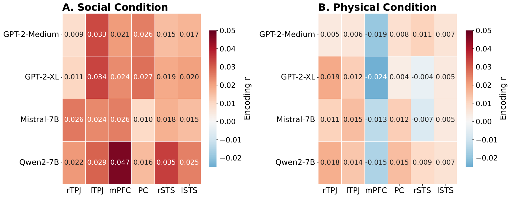
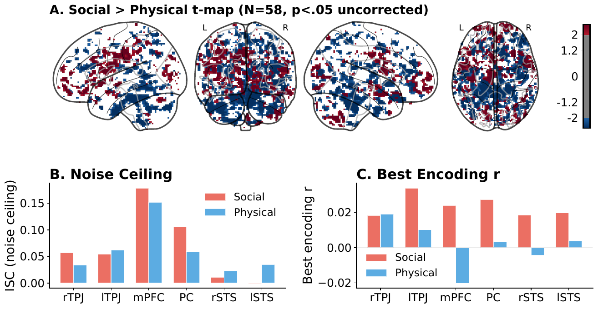
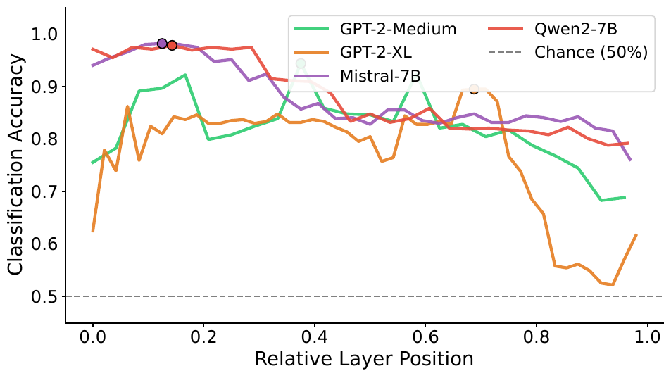
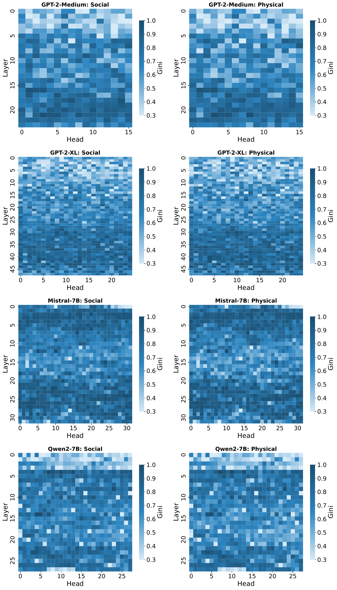

<div align="center">

# Attention Mechanisms for Theory of Mind

### Weak brain-transformer alignment despite behavioral success

**Xiaoyan Li · Cuicui Jiang · Jiaoping Chen\* · Rumei Yang · Xingyue Liu · Jiaxuan Wei**

\*Corresponding author: jchen@ubalt.edu

*IEEE International Conference on Bioinformatics and Biomedicine (BIBM 2026), regular paper*

[](https://www3.cs.stonybrook.edu/~bibm2026/)
[](IEEE_manuscript/camera_ready/B323_camera_ready.pdf)
[](https://openneuro.org/datasets/ds002345)
[](requirements.txt)
[](LICENSE)



<sub>Best time-resolved encoding correlation between each transformer's hidden states and BOLD in six Theory-of-Mind regions (N = 58), for social (left) and physical (right) narratives. The largest value on the whole grid is <i>r</i> = 0.047 (Qwen2-7B, mPFC), about 19% of the noise-ceiling upper bound.</sub>

</div>

---

## TL;DR

Do transformers that *pass* Theory-of-Mind (ToM) tests process social content the way human brains do? We put four language models (355M to 7B parameters) and 58 fMRI participants through a **modality-matched** paradigm: people listened to social versus physical descriptions of the same animated shapes, and the models read the identical transcripts.

- ✅ **Behavior** — the 7B models solve classic ToM items (false belief, faux pas, intention) at 75 to 83% accuracy; GPT-2 variants sit at chance.
- ✅ **Representation** — a linear probe separates social from physical narrative from hidden states at 89 to 98% accuracy (bag-of-words baseline 74%).
- ✅ **Mechanism** — zero-ablating single attention heads produces large drops in mental-state word prediction, but the top-5% head set is only partly stable across 19 prompts.
- ❌ **Brain alignment** — time-resolved encoding models reach at best *r* = 0.047, and with unbiased layer selection **0 of 48 cells survive FDR**. The result holds across hemodynamic lags, non-linear encoders and smaller ROIs.
- 🧠 **The brain itself** shows a clear fronto-temporal social > physical pattern; the models' social > physical encoding advantage (86% of 792 contrasts) never survives correction.

Transformers can be behaviorally competent at ToM while representing social content through mechanisms that align only weakly with human neural responses.

## Key results

| Analysis | What was measured | Result |
|---|---|:-:|
| Behavioral ToM benchmark | Accuracy on false belief, faux pas and intention items (chance 50%) | Qwen2-7B **83.3%**, Mistral-7B **75.0%**, GPT-2-XL 45.8%, GPT-2-Medium 50.0% |
| Linear probing | Social vs. physical from hidden states, best layer | **89 to 98%** (Mistral-7B 98.2% at layer 4); bag-of-words 73.6% |
| Encoding models | Best *r* between model features and BOLD, six ToM ROIs | **0.047** (mPFC, Qwen2-7B), 16 to 21% of the noise ceiling |
| Encoding vs. zero | Leave-one-subject-out layer choice, BH-FDR over 48 cells | **0 / 48** survive (smallest *q* = 0.09) |
| Social vs. physical encoding | 792 model × layer × ROI contrasts | 86% numerically favor social, **0 survive FDR** |
| Whole-brain contrast | Voxel-wise paired *t*-test, N = 58 | Fronto-temporal social > physical pattern |
| Attention sparsity | Gini, entropy and top-*k* mass, paired over layers | Reliably but slightly sparser for social narratives |
| Causal head ablation | Zero-ablation sweep, 19 narrative-derived prompts | Large single-head effects (e.g. GPT-2-Medium L6H1); split-half Jaccard of the critical set 0.05 to 0.30 |
| Robustness | HRF lags 0 to 6 TRs, kernel ridge and MLP encoders, 8 mm and 6 mm ROIs, GPT-2 truncation | Alignment stays weak (best *r* = 0.051) |

### Behavioral ToM accuracy (% correct)

| Model | Params | Overall | False belief | Faux pas | Intention |
|---|:-:|:-:|:-:|:-:|:-:|
| GPT-2-Medium | 355M | 50.0 | 40.0 | 50.0 | 62.5 |
| GPT-2-XL | 1.5B | 45.8 | 40.0 | 33.3 | 62.5 |
| Mistral-7B | 7B | 75.0 | 60.0 | 66.7 | **100.0** |
| Qwen2-7B | 7B | **83.3** | **70.0** | **83.3** | **100.0** |

## Results in figures

<div align="center">
 physical t-map, noise ceiling and best encoding r per ROI">

<sub><b>The brain does distinguish the conditions.</b> (A) Voxel-wise social > physical <i>t</i>-map across 58 participants. (B) Inter-subject-correlation noise ceiling per ROI. (C) Best encoding <i>r</i> per ROI: the models capture a small fraction of the reliable signal.</sub>
</div>

<br>

<div align="center">


<sub><b>The information is there.</b> Linear probes read social vs. physical content from every model's hidden states far above chance; circled markers are each model's peak layer.</sub>
</div>

<br>

<div align="center">


<sub><b>Attention is slightly sparser for social narratives.</b> Gini coefficient per layer (rows) and head (columns) for each model; social left, physical right.</sub>
</div>

## Data

**OpenNeuro ds002345** (Narratives, "Shapes" social-attribution task): 59 participants listened to a social and a physical description of the same Heider-Simmel-style animation. Participant sub-115 was excluded for incomplete posterior coverage, so **N = 58** in every analysis. Transcripts were produced with Whisper and validated against the dataset's word counts; the word-level timestamps are what makes the paradigm modality-matched.

The fMRI data (about 23 GB) and the model weights are not in this repository. Place the dataset under `data/ds002345/` and the Hugging Face checkpoints under `models/huggingface_cache/`; the paths are set in `configs/config.py`.

## Models

| Model | Params | Layers | Hidden size |
|---|:-:|:-:|:-:|
| GPT-2-Medium | 355M | 24 | 1024 |
| GPT-2-XL | 1.5B | 48 | 1600 |
| Mistral-7B | 7B | 32 | 4096 |
| Qwen2-7B | 7B | 28 | 3584 |

`configs/config.py` also lists DeepSeek-MoE-16B and Phi-3-Mini; neither was run and neither appears in the paper.

## Pipeline

```bash
pip install -r requirements.txt
python run_pipeline.py                # all stages
python run_pipeline.py --stage 3      # a single stage
python run_pipeline.py --visualize    # stage 7 only
bash scripts/camera_ready/run_cpu_chain.sh   # reviewer-requested analyses (CPU part)
```

| Stage | Script | What it does |
|:-:|---|---|
| 1 | `s01_fmri_preprocessing.py` | fMRI preprocessing and ROI time-series extraction |
| 1b | `s01b_wholebrain_contrast.py` | Whole-brain social > physical group *t*-map |
| 2 | `s02_llm_extraction.py` | Time-resolved feature extraction from the transcripts |
| 3 | `s03_encoding_models.py` | **Encoding models: the brain-model alignment test** |
| 4 | `s04_attention_analysis.py` | Attention sparsity and specialization |
| 5 | `s05_causal_analysis.py` | Causal attention-head ablation |
| 6 | `s06_probing.py` | Linear probing of social vs. physical content |
| 7 | `s07_visualization.py` | Publication figures |
| 8 | `s08_behavioral_tom.py` | Behavioral ToM benchmark |

The analyses added for the camera-ready version (noise ceiling, lag sweep, non-linear encoders, GPT-2 truncation, bag-of-words probe, extended ablation, ROI-radius control) are in `scripts/camera_ready/` (`cr00` to `cr11`).

## Repository layout

```
Attention_ToM/
├── run_pipeline.py
├── configs/config.py            # paths, model list, ROIs
├── scripts/                     # s01 to s08 (table above)
│   └── camera_ready/            # cr00 to cr11, run_cpu_chain.sh
├── results/
│   ├── run_20260924_cameraready/   # corrected run: the numbers in the paper
│   └── run_20260415_stage1/        # submitted-version run, kept for reference
├── assets/                      # README figures (PNG renders of the paper figures)
├── IEEE_manuscript/             # submitted version; camera_ready/ holds the final PDF and source
├── logs/
├── data/                        # ds002345 (not tracked)
└── models/huggingface_cache/    # model weights (not tracked)
```

## Corrections relative to the submitted manuscript

While adding the reviewer-requested analyses we found that stage 2 had mis-aligned model features and fMRI time points: byte-level and SentencePiece character offsets include the leading space, so only about 15% of words were matched to their word-initial token; the story-start search silently fell back to offset 0, so every TR used features from about 80 words earlier; and the 4.5 s audio onset was ignored. All three are fixed in `s01_fmri_preprocessing.py` and `s02_llm_extraction.py`, PCA uses an exact SVD, and the story now spans exactly the 272 and 270 TRs given in the dataset metadata. Every number in the paper and in this README comes from the corrected run. The camera-ready version also reports the sparse-head fraction as the observed range (78.6 to 96.1%) rather than "over 80%".

## Citation

```bibtex
@inproceedings{li2026attention_tom,
  title     = {Attention Mechanisms for Theory of Mind: Weak Brain-Transformer
               Alignment Despite Behavioral Success},
  author    = {Li, Xiaoyan and Jiang, Cuicui and Chen, Jiaoping and Yang, Rumei
               and Liu, Xingyue and Wei, Jiaxuan},
  booktitle = {Proceedings of the IEEE International Conference on Bioinformatics and
               Biomedicine (BIBM)},
  year      = {2026}
}
```

## Acknowledgments

fMRI data are from the Narratives collection (Nastase et al., 2021), OpenNeuro ds002345. Model weights are from the Hugging Face Hub under their respective licenses.

Corresponding author: Jiaoping Chen · jchen@ubalt.edu

Code is released under the [MIT License](LICENSE).
